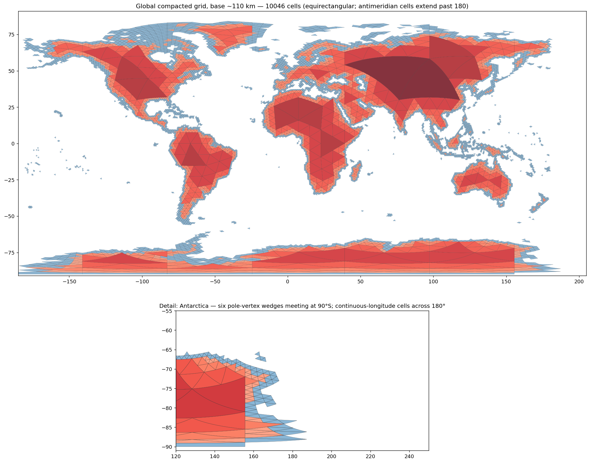

# Trifold (T3) — a hierarchical triangular DGGS with *exact* nesting

**Triangles tile the sphere into a quadtree where every parent is *exactly*
the union of its four children — something neither hexagons nor most
square systems can offer — with a 6-character address for a ~110 km cell.**

**[Live demo & intro site](https://jaakla.github.io/trifold/)** · globe ↔ flat ·
7 grid systems side by side · click any cell for its address ·
[technical reference](docs/t3-technical-reference.md)



---

## 1. The idea in 30 seconds

Start from the icosahedron: 20 spherical triangles covering the Earth.
Split every triangle into 4 by connecting the great-circle midpoints of its
edges. Repeat. Each level halves the edge length and quadruples the cell
count (*aperture 4*):

| level | mean edge | mean area | cells (global) |
|---:|---:|---:|---:|
| 0 | 7,054 km | 25.5M km² | 20 |
| 3 | 882 km | 399k km² | 1,280 |
| 6 | 110 km | 6,226 km² | 81,920 |
| 9 | 13.8 km | 97 km² | 5.2M |
| 12 | 1.7 km | 1.5 km² | 336M |
| 15 | 215 m | 24 ha | 21.5B |

Because children are built from the parent's own vertices plus edge
midpoints, **a parent cell is bit-for-bit the union of its children**.
Aggregating data up the hierarchy or drilling down loses nothing and
double-counts nothing. That property — *exact congruent nesting* — is the
heart of this project, and it is genuinely rare among global grids
(see [§6](#6-fair-comparison-with-other-dggs)).

The repository contains the Python library, a three-form addressing codec,
global grid products generated against Natural Earth land, generators for
three rival grid systems, an interactive MapLibre demo (globe and flat),
and a Cloudflare Worker that serves any cell on demand from pure math.

---

## 2. Addressing: one identity, three encodings

A cell is identified by `(face, path)`: which of the 20 icosahedron faces
it lives on, and the sequence of base-4 digits choosing a child at every
subdivision (`0,1,2` = corner children toward the parent's vertices,
`3` = the central, orientation-flipped child).

The same identity has three interchangeable encodings, each optimized for
a different consumer:

| form | example (London, level 6) | for | size |
|---|---|---|---|
| **compact** | `TF6958` | humans, URLs, labels, CSV columns | 3 + ⌈2L/5⌉ chars |
| **path** | `F15-102111` | teaching, debugging — shows the tree descent | 4 + L chars |
| **addr64** | `8811996358392152070` | compute — sort, join, mask | 8 bytes |

**Why not just digits 0–3?** A digit string spends 8 bits per character to
carry 2 bits of information. The compact form re-encodes the *same* path
bits in Crockford base32 (5 bits/char, no ambiguous `I L O U`), prefixed
by face and level characters: `T` `F`(face 15) `6`(level 6) `958`(12 path
bits in 3 chars). Level 15 — sub-kilometre cells — still fits in 9
characters. Base64 would save little and break URLs; raw binary is
unreadable. Base32 is the sweet spot.

**The uint64 layout** packs face (5 bits) + up to 27 path digits (54 bits)
+ level (5 bits). The path is left-aligned and the level is the low-bit
tie-breaker that places a parent before its descendants:

```
 63       59                                                       5     0
 ┌─────────┬────────────────────────────────────────────────────────┬─────┐
 │ face:5  │ path digits, 2 bits each, left-aligned                 │ L:5 │
 └─────────┴────────────────────────────────────────────────────────┴─────┘
```

Left-alignment and the low level field provide these properties:

* numeric sort = depth-first hierarchical order within a face
  (Z-order curve — spatially adjacent cells tend to be numerically close);
* parent and child addresses are direct masks/shifts — no tree traversal;
* `is_ancestor(a, b)` = one shift and compare;
* `descendant_range(a)` returns the inclusive uint64 interval containing
  that cell and all descendants, suitable for database range scans.

**Compatibility:** this corrected field order changes numeric `addr64`
values produced by the initial v0.1.0 code. Compact and path addresses are
unchanged; regenerate stored numeric IDs from either string form.

```python
import trifold as tg
addr = tg.encode64(*tg.locate(-0.1276, 51.5072, level=6))
tg.to_compact(addr)        # 'TF6958'
tg.to_path(addr)           # 'F15-102111'
tg.to_compact(tg.parent64(addr))   # 'TF595'
[tg.to_compact(c) for c in tg.children64(addr)]
# ['TF7958', 'TF795A', 'TF795C', 'TF795E']
```

Same answers from the command line (`pip install -e .`):

```console
$ trifold locate -0.1276 51.5072 6
TF6958
$ trifold show TF6958
compact : TF6958
path    : F15-102111
addr64  : 8811996358392152070 (0x7A4A800000000006)
level   : 6
edge_km : 116.9
area_km2: 5864
$ trifold geom TF6958 > london_cell.geojson
```

…and from the [Cloudflare Worker](worker/cell-server.js)
(`GET /locate/-0.1276,51.5072?level=6` → `TF6958`), which is a faithful
JS port — the two implementations are cross-tested to agree.

---

## 3. Grid products

Built against Natural Earth 1:50m land, base level 6 (~110 km edges):

| product | cells | GeoJSON | TopoJSON |
|---|---:|---:|---:|
| **uncompacted** — every level-6 cell touching land | 27,614 | 14 MB | 9 MB |
| **compacted** — interior cells merged up the quadtree as far as they stay wholly on land; coast stays at level 6 | 10,046 | 6 MB | 3.5 MB |

Both cover the identical 171.1M km² (149M km² of land + the seaward
overhang of coastal cells), verified to 0 invalid geometries. Per-cell
properties: `id` (compact), `path`, `addr64`, `level`, `interior`,
`edge_km`, `area_km2`, `pole`, `xam`.

TopoJSON is the recommended interchange form for grids: every triangle
edge is shared by two cells, so arc deduplication cuts size ~40–60%. To
make arcs shared even between *different-sized* neighbours in the
compacted grid, edges are densified by recursive midpoint subdivision to a
fixed sub-lattice — a large cell's boundary passes through its small
neighbours' vertices bit-exactly.

### Special cases (where global grids go to die)

* **Antimeridian.** Cells crossing ±180° are written with *continuous*
  longitudes (e.g. `176 → 184`). This intentionally deviates from RFC 7946
  §3.1.9 ("should be split"): splitting would destroy triangle semantics
  and TopoJSON arc sharing, and MapLibre/Leaflet/deck.gl all render
  continuous longitudes correctly. Cells carry `xam: true` so you can
  re-split for strict-RFC consumers if needed. Classification of these
  cells runs against land copies translated ±360°.
* **Poles.** A pleasing accident of the icosahedron's geometry: in this
  orientation both poles are *lattice vertices* (the south pole is exactly
  the normalized midpoint of an icosahedron edge), so six triangles meet
  at each pole. They are exported as meridian wedges reaching exactly ±90°
  — like UTM-zone tips — and flagged `pole: "vertex"`. Classification near
  the poles runs in polar azimuthal-equidistant frames, where lon/lat
  pathologies do not exist.
* **No samples, no shortcuts.** Land/sea classification is exact polygon
  containment in an appropriate frame, not point sampling.

---

## 4. What triangles are genuinely good for

* **Lossless multi-resolution aggregation.** Sum level-9 statistics into
  level-6 cells and the numbers are *exact* — no boundary slivers, no
  overlap weighting. This is the killer feature versus hexagons.
* **Variable-resolution coverage** (the compacted mode): one dataset,
  coarse where uniform, fine where it matters — with cells that still
  snap together perfectly. Database range scans over `addr64` retrieve
  any subtree as one interval.
* **Simplicial data structures.** Triangles are *the* primitive of
  numerical geometry: FEM/FVM meshes, terrain TINs, barycentric
  interpolation, subdivision surfaces. A triangular DGGS plugs into that
  machinery directly; quads and hexes need conversion.
* **Geodesic honesty at every scale.** Cells are quasi-equilateral
  everywhere — no polar singularity, no latitude-dependent area collapse
  (a lon/lat grid cell at 80°N has ~17% of its equatorial area; Trifold
  cells vary ~±20% worldwide, smoothly).
* **Sampling designs and ecology-style survey grids**, where equal-ish
  area and hierarchical refinement matter more than neighbour traversal.

## …and what they are *not* good for (honesty section)

* **Neighbour-heavy algorithms.** A triangle has 3 edge-neighbours but 9
  more vertex-neighbours, and alternating up/down orientation makes
  "movement" semantics awkward. Hexagons' 6 uniform neighbours are simply
  better for diffusion, routing, cellular automata, and game-of-life-style
  analyses. (Neighbour traversal across icosahedron face boundaries is
  also unimplemented here — see roadmap.)
* **Human visual comfort.** Hex maps look calm; triangle maps look
  technical. For choropleth-style communication to general audiences,
  H3 will usually present better.
* **Anisotropy-sensitive statistics.** Up- and down-pointing cells are
  congruent but rotated 60°; kernel-based methods that assume identical
  cell orientation need care.
* **Tiny-scale local work.** Below ~city scale, just use a projected CRS
  and a planar grid; a global DGGS buys you nothing there.

---

## 5. The demo

`docs/index.html` (GitHub Pages-ready, https://jaakla.github.io/trifold/)
— a single self-contained landing page: the full introduction (concept,
addressing, comparison, use cases, serving) with the interactive viewer
embedded as its centerpiece:

* **7 systems**: Trifold (T3) triangles, [A5](https://a5geo.org) pentagons,
  H3 hexagons, authentic S2 quads (s2sphere), rHEALPix (aperture 9,
  near-equal-area), HTM octahedral triangles (T3's astronomy ancestor,
  built with T3's own machinery), and lon/lat rectangles — same land,
  same styling, honest side-by-side;
* **globe ↔ flat** toggle (MapLibre GL v5 native globe projection — watch
  what Mercator does to the Antarctic pole wedges, then switch to globe);
* compacted ↔ uncompacted, three triangle resolutions, click-for-address.

Workshop choreography that works well: start on *Lon/lat, flat* (audience
nods, looks normal) → switch to *globe* (poles collapse — laughter) →
*Cube quad* (better, but spot the face-corner distortion) → *H3* (lovely,
but ask "what's the parent of this hexagon?") → *A5* (exactly equal
areas — then ask the same parent question) → *rHEALPix* (equal-area the
OGC way, mind the polar darts) → *HTM* (triangles, but watch the
octahedron's distortion) → *Trifold compacted*
(exact nesting punchline) → click a cell, read `TF6958` aloud, then
`curl` the same address from the Worker. Five minutes, full arc.

---

## 6. Fair comparison with other DGGS

| | **Trifold** (this) | **A5** (pentagon) | **H3** (hex) | **S2** (square) | **rHEALPix** | **Geohash / slippy** |
|---|---|---|---|---|---|---|
| cell shape | spherical triangle | equilateral pentagon | hexagon (+12 pentagons) | curvilinear quad | quad (squashed at caps) | lon/lat rect |
| aperture | 4 | 4 (logical) | 7 | 4 | 9 | 4 (slippy) / 32 (geohash) |
| **exact parent⊃child nesting** | **yes, congruent** | no (logical only, index-exact) | **no** (≈7 children, ragged) | yes (within face) | yes | yes (but planar) |
| equal area | ~±20%, smooth | **exactly equal** per level | ~±35% across res; pentagons differ | up to ~2× corner/centre | **exactly equal-area** | wildly unequal by latitude |
| neighbours | 3 edge + 9 vertex, mixed | 5, two distance classes | **6 uniform** (best) | 4 + 4 | 4 + 4 | 4 + 4 |
| pole handling | vertex wedges, clean | clean | clean | clean | polar caps, clean | **singular / degenerate** |
| index arithmetic | uint64, prefix = subtree | uint64, Hilbert | uint64, well-engineered | uint64, superb (Hilbert) | string/int | string prefix |
| ecosystem | this repo 🙂 | young (2025), growing fast | **huge** (Uber, DuckDB, BigQuery…) | huge (Google, S2geometry) | academic, OGC-adopted | universal |
| best at | lossless hierarchy, simplicial/FEM work, multi-res coverage | density-honest statistics, equal-area viz | neighbour ops, viz, analytics joins | indexing, range queries, storage | equal-area statistics | quick hacks, tiling |

Honest bottom line: **if you need neighbour traversal or a mature
ecosystem, use H3; if you need pure spatial indexing, use S2; if you need
strictly equal areas, use rHEALPix — or its modern web-native cousin
[A5](https://a5geo.org).** Trifold's niche is real but
specific: *exact* hierarchical aggregation, variable-resolution tilings
that snap, and any pipeline that already thinks in triangles. The demo's
comparison mode exists precisely so you can check these claims visually.

Kin and prior art: OGC DGGS Abstract Specification (Topic 21); ISEA3H /
DGGRID (icosahedral, aperture 3/4 hex); QTM (Dutton's Quaternary
Triangular Mesh — the closest ancestor of this scheme, octahedron-based);
SCENZ-Grid; HTM (Hierarchical Triangular Mesh, used in astronomy — also
triangular aperture-4, octahedron-based; Trifold is essentially "HTM on an
icosahedron with modern addressing and web tooling" — the demo includes
an authentic octahedral HTM layer so the difference is visible, not
asserted); and
[**A5**](https://a5geo.org) (Felix Palmer, 2025) — a dodecahedron-based
pentagonal DGGS that is in many ways Trifold's mirror image: it trades
exact geometric nesting (its aperture-4 hierarchy is logical, with exact
*index* prefixes but only approximate parent/child geometry) for
**exactly equal-area cells** within each level via a Snyder-derived
equal-area projection. Same 64-bit-integer indexing philosophy, opposite
corner of the design space — which is why it's in the demo's comparison
mode (`scripts/build_a5_layer.py`, using the official
[`pya5`](https://pypi.org/project/pya5/) library).

---

## 7. Serving at scale

Embedded TopoJSON (as in the demo) is fine to ~30k cells / ~10 MB. Beyond
that, two production paths, both serverless:

**Pregenerated PMTiles** — `scripts/make_pmtiles.sh` converts any product
to a single-file vector-tile archive via tippecanoe. Host it on anything
with HTTP Range support (Cloudflare R2/Pages, S3; *not* plain GitHub
Pages) and point MapLibre at `pmtiles://…`. Level 8 (~28 km, ~440k land
cells) tiles to a few tens of MB and renders instantly; this is the right
answer for "show me everything".

**Dynamic generation** — `worker/cell-server.js`, deployable free with
`npx wrangler deploy`. No stored data: cells are regenerated from pure
math on every request and cached at the edge (`/cell/TF6958`,
`/locate/lon,lat?level=N`, `/children/…`, `/cells/a,b,c`). This is the
right answer for "give me *these* cells" — apps that know which addresses
they need (from a database join on `addr64`, say) and fetch geometry
lazily. The two approaches compose: PMTiles for the basemap-of-cells,
Worker for interactive lookup.

---

## 8. Repository layout

```
src/trifold/        library: address.py · core.py · classify.py · grid.py · cli.py
scripts/            build_grids.py · build_comparison_dggs.py · build_a5_layer.py · build_more_dggs.py · make_site.py · make_pmtiles.sh
worker/             cell-server.js (Cloudflare Worker, zero-data cell API)
docs/               index.html (landing page + demo — GitHub Pages ready) ·
                    t3-technical-reference.md · img/
data/               generated products (gitignored; see data/README.md)
tests/              test_address.py
```

Quickstart:

```bash
poetry install --all-extras
poetry run pytest tests/
poetry run python scripts/build_grids.py --levels 4 5 6
poetry run python scripts/build_comparison_dggs.py
poetry run python scripts/build_a5_layer.py
poetry run python scripts/build_more_dggs.py
poetry run python scripts/make_site.py          # → docs/index.html
```

After `eval "$(poetry env activate)"`, omit `poetry run`:

```bash
pytest tests/
python scripts/build_grids.py --levels 4 5 6
python scripts/build_comparison_dggs.py
python scripts/build_a5_layer.py
python scripts/build_more_dggs.py       # S2 + rHEALPix + HTM layers
python scripts/make_site.py              # → docs/index.html
```

---

## Development environment

Poetry is the recommended development environment:

```bash
poetry install --all-extras
eval "$(poetry env activate)"  # activate in the current zsh/bash session
```

Poetry 2.x no longer includes `poetry shell` by default. It manages this
environment itself and may not install `pip`; do not run pip installation
commands while the prompt starts with `(trifold)`. Use `poetry add` to add
dependencies, or `poetry run COMMAND` without activating the environment.

Alternatively, use a standard virtual environment instead of Poetry:

```bash
deactivate 2>/dev/null || true  # leave the Poetry environment first
python -m venv .venv-pip
source .venv-pip/bin/activate
python -m ensurepip --upgrade
python -m pip install -e ".[build,dev]"
```

`tippecanoe` is required for `scripts/make_pmtiles.sh` (OS-level tool):

```bash
# macOS (Homebrew)
brew install tippecanoe

# Linux: build from source or use the docker image; the script assumes `tippecanoe` is on PATH
```

PMTiles are built from generated level-6 GeoJSON files. Generate those
files first, then run `tippecanoe` through the wrapper:

```bash
python scripts/build_grids.py --levels 6
./scripts/make_pmtiles.sh
```

The grid build requires the Natural Earth checkout described in
Natural Earth 1:50m land data. The default build downloads and verifies the
pinned v5.1.2 GeoJSON automatically. Use `--land PATH` to supply another
local dataset instead.

## 9. Roadmap

* neighbour traversal across face boundaries (edge-adjacency tables)
* level 7–9 products + PMTiles in CI
* vectorized `locate` (numpy batch) and a DuckDB UDF for `addr64` joins
* optional ISEA-style equal-area variant (snyder projection per face)
* polygon→cells fill (`polyfill` equivalent)

## License

MIT. Land data: [Natural Earth](https://www.naturalearthdata.com/) (public
domain). Built with shapely, pyproj, geopandas, topojson, MapLibre GL,
topojson-client, H3 (comparison layer).
